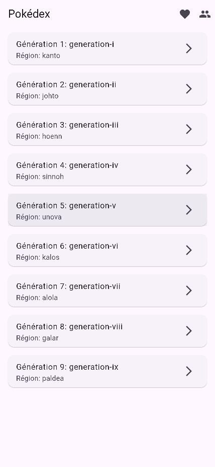
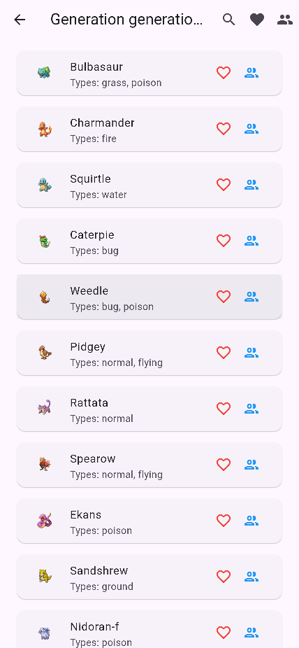
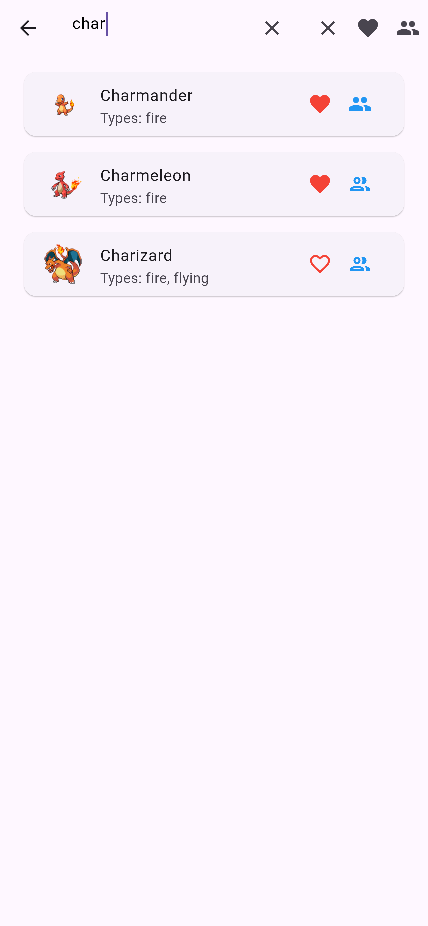
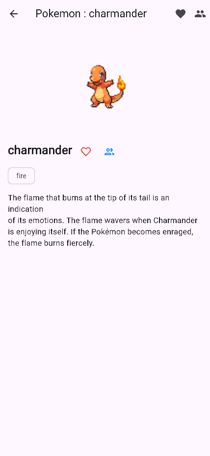
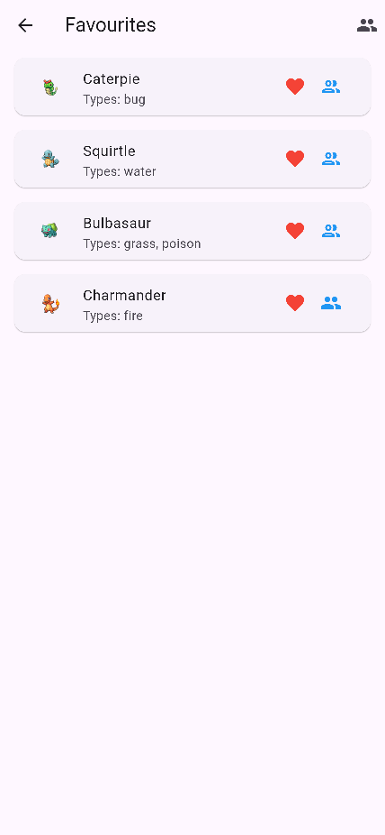
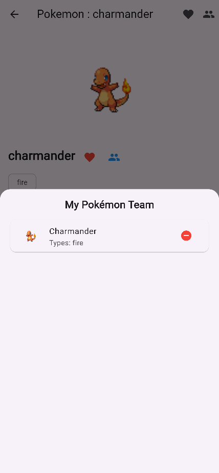

# Pokemon Pokedex App 
## (Pierre GERVAIS - Eduardo GAGLIARDI)

 

### Features :

- Affichage des générations **(liste scroll)** **[screen dédié]**.
- Affichage des pokemon d'une génération **(liste scroll)** **[screen dédié]**.
- Ajouter/Retirer un pokemon à une liste de favoris **[button_icon fav]** **[local storage]** **(liste scroll)** **[screen dédié]**.
- Ajouter/Retirer un pokemon à une equipe (max 6) **[side bar]**.
- Affichage détails d'un pokemon quand on clique dessus **[popup overlay]**.
- Faire une recherche dans une génération de pokemon.

 

### App content :

#### App bar :
- Icon boutton pour **[Favoris screen]**
- Titre de l'application.
- Icon boutton pour **[Pokemon team (popup Overlay)]**.

#### Home SCREEN :
- **[App bar]**.
- Liste Scroll **[Display génération widget]**.

#### Génération SCREEN :
- **[App bar]**.
- **[Sear bar]**
- Liste Scroll **[Display pokemon widget]**.

#### Display génération WIGET :
- Title : "Génération n°x".
- Region : Nom de la région liés à la génération.

#### Display pokemon WIDGET :
- Nom du pokemon.
- Icon du pokemon.
- Types du pokemon.

#### Search Bar :
- Input pout une recherche.

### App preview :

#### Home Screen :

#### Generation Screen :

#### (Search) Generation Screen :

#### Pokemon Screen :

#### Favorites Screen :

#### Team Popup :
